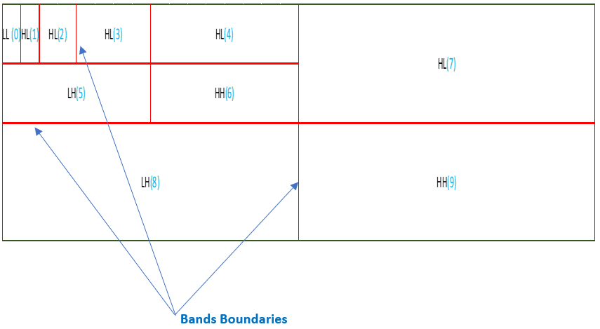
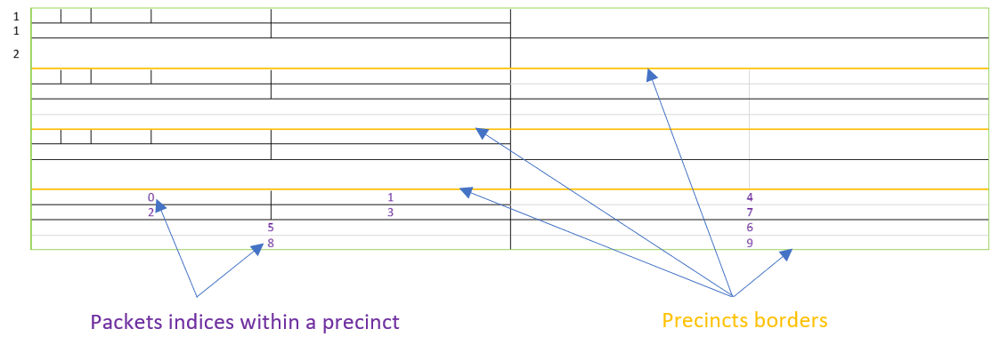
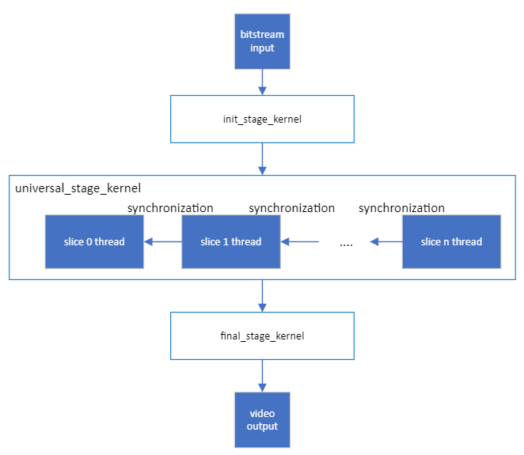
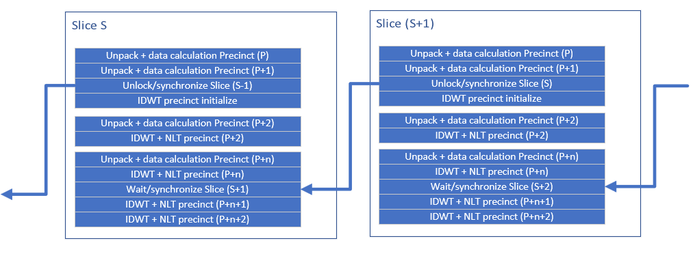

[Top level](../../README.md)

# Decoder Design for SVT-JPEGXS (Scalable Video Technology for JPEGXS Decoder)

## Table of Contents

## List of Figures

- [Figure 1](#figure-1): 5-level horizontal and 2-level vertical Picture decomposition into bands for Luma component
- [Figure 2](#figure-2): 1 Slice, 4 Precincts and multiple Packets diagram
- [Figure 3](#figure-3): High-level decoder process dataflow
- [Figure 4](#figure-4): Modules of the SVT-JPEGXS decoder and slices synchronization 

## Introduction

This document describes the Intel SVT-JPEGXS decoder design. In particular, the
decoder block diagram and multi-threading aspects are described. Besides, the
document contains brief descriptions of the SVT-JPEGXS decoder modules. This document is meant to be an accompanying document to the &quot;C Model&quot; source code, which contains the more
specific details of the inner working of the decoder.

# Definitions

This section contains definitions used throughout this design document.

### General Definitions

| **Term**                 | **Definition**                                                                                                        |
| ---                      | ---                                                                                                                   |
| Picture                  | Collection of luma and chroma samples assembled into rectangular regions with a width, height and sample bit-depth.   |
| Slice		           | integral number of precincts whose wavelet coefficients can be entropy-decoded independently |
| Precinct                 | collection of quantization indices of all bands contributing to a given spatial region of the image |
| Band		            | input data to a specific wavelet filter type that contributes to the generation of one of the components of the image |
| GTLI              	 | (values 0-15) (Greatest Trimmed Line Index) Single value calculated per band, Restored in decoder from Quantization, Refinement and WeightTables. Specify number of least significant bits that will be removed during quantization|
| GCLI                 | (values 0-31) (Greatest common line index) Max used bits in group of 4 coefficients, when value <= GTLI all coefficients will be 0                                    |
| Significance Value                    | Max used bits in group of 8 GCLI's or 32 coefficients, when value <= GTLI all values can be ignored.                                                    |
| SignificationBit 	| (Significance Value < GTLI) if 0 ignore group for specific GTLI when GTLI >= GCLI.                                                     |
| Quantization value                      | Quantization bits (remove least significant bits from value with some rounding deadzone/uniform) (Value >> GTLI) when (GTLI >= GCLI) then 0 Pack data bits – Bits to pack value in bitstream GCLI-GTLI. If less than 0 then pack 0 bits.   |

### Source Partitioning

The source picture is partitioned into various slices. Each slice is further divided into precincts.

Figure 1 shows the decomposition of the picture for one component into bands after Discrete Wavelet Transform (DWT) decomposition.

#### Figure 1: 5-level horizontal and 2-level vertical Picture decomposition into bands for Luma component

Figure 2 shows the relationship between slice, precincts and packets.
A slice is divided into precincts. The grouping of lines of bands into packets is shown in the fourth precinct. Each packet contributes to one line and one or multiple bands of a precinct.
Furthermore each packet consists of multiple subpackets where each subpacket contributes to one aspect of the data, such as significance, GCLI, quantized coefficients and signs.

#### Figure 2: 1 Slice, 4 Precincts and multiple Packets diagram

## High-level decoder architecture

The high-level decoder pipeline is shown in Figure 3. Further details on
individual stages are given in subsequent sections. The multi-threading aspect
of the decoder is also explained in detail in a separate section. 

The architecture is simplistic and flexible enough to support an implementation in which
one slice at a time is decoded through the entire pipeline with a small delay due to synchronization between slices. Precincts from slice (s+1) are used to inverse transform precincts (p+n+1) and (p+n+2) from slice (s) if vertical decomposition is > 0.

In the SVT-JPEGXS decoder, a picture is divided into slices.
Parallelism in the decoder is achieved at the slice level. 
Multiple slices from the same picture could be processed simultaneously, where each process could, for example, be performing a different task in the decoding pipeline.

A high-level diagram of the decoder pipeline is shown in Figure 3.

#### Figure 3. High-level decoder process dataflow 

## Initialization Stage

 
 The initialization stage is a single threaded process. It is where picture header parsing is done along with picture buffers allocation.

### Universal Stage
Universal stage kernel is where the main decode modules are executed.
This stage is slice based. It reads the slice header, loops over precincts to unpack precinct, inverse quantize it and inverse transform it. Precinct decoding is described in details in the decoder algorithms section.

### Final Stage
The final process is where all the synchronization is done: Releasing objects and reordering queues. Slices are properly aligned with corresponding picture to properly reconstruct the picture from slices.

When different color transformation is enabled (example: RGB->YUV or Star-Tetrix), "unpack precinct" and "precinct calculate data) is still performed in the universal stage but inverse transform IDWT and color transformation are performed in the final stage.

Moreover, if default slice height is smaller or equal to two precinct and vertical decomposition is > 0 , IDWT is performed in the final stage.

## Decoder Algorithms

The following section describes the algorithms used in the
SVT-JPEGXS decoder per slice. The algorithms are done sequentially for each precinct in the slice.

An illustration of slice-based modules of the SVT-JPEGXS decoder and slices synchronization is shown in Figure 4.

#### Figure 4. Modules of the SVT-JPEGXS decoder and slices synchronization 

### Unpack Precinct

This module is where the GCLI and sign bits are being unpacked from bitstream through reading coefficients and prediction modes ( raw, vertical, significance or zero).
The process is done at the sub-packet level for every band.

### Data Calculation for Precinct

After the unpack stage, coefficients are being inverse quantized in the data calculation stage.
Inverse quantization type can be either uniform or deadzone.

After dequantization inv_image_shift is performed, this stage prepares dequantized coefficients for inverse transform by 2 steps:
1. Left-shift each coefficient by number of bits specified in bitstream header(IDWT use fixed-point arithmetic, left-shift increase precision)
2. Change coefficient coding from signbit(most significant bit) + abs(dwt) to U2.

### IDWT [Inverse transform Precinct]

Inverse transform is performed for every component per precinct.
As there is a dependency between slices, a recalculation of two previous precinct is needed.

### MCT [Multiple component transformations]

Optional stage that transforms the output array of the inverse wavelet transformation to intermediate picture samples values of the picture (RGB or Star-Tetrix)

### NLT [Linear/Non-linear output scaling]

This stage uses intermediate picture sample values from MCT or IDWT (if MCT is not present) and reconstructs final picture. Reconstruction is done by reducing bit precision (fixed point) and applying scaling method (Linear, Quadratic or Extended)

## Notes

The information in this document was compiled at <mark>v0.10</mark> of the code and may not
reflect the latest status of the design. For the most up-to-date
settings and implementation, it's recommended to visit the specific section of the code.
