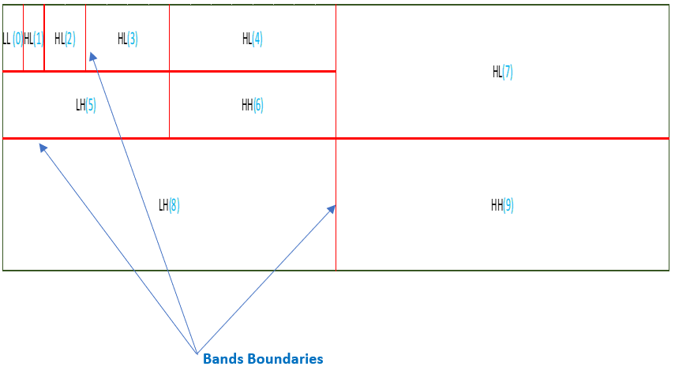
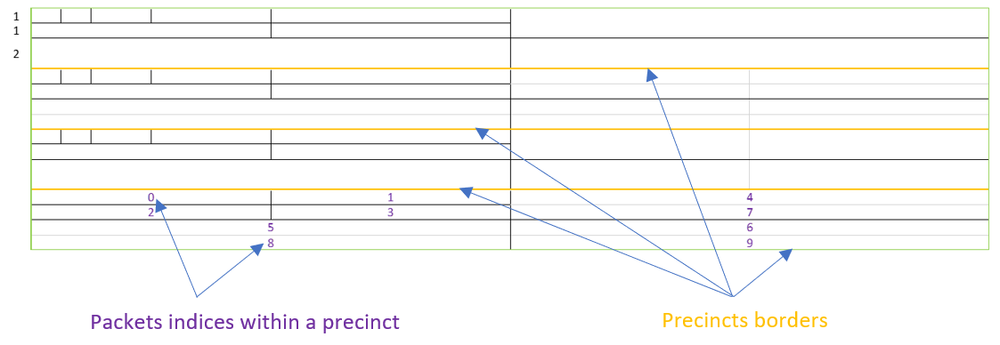
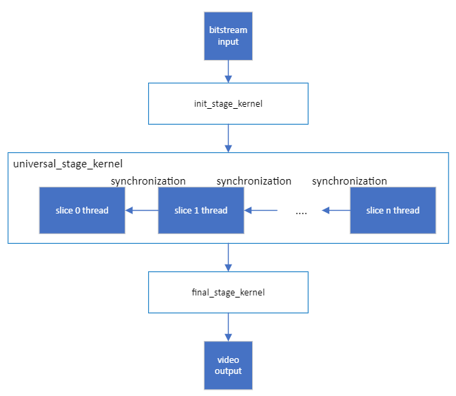
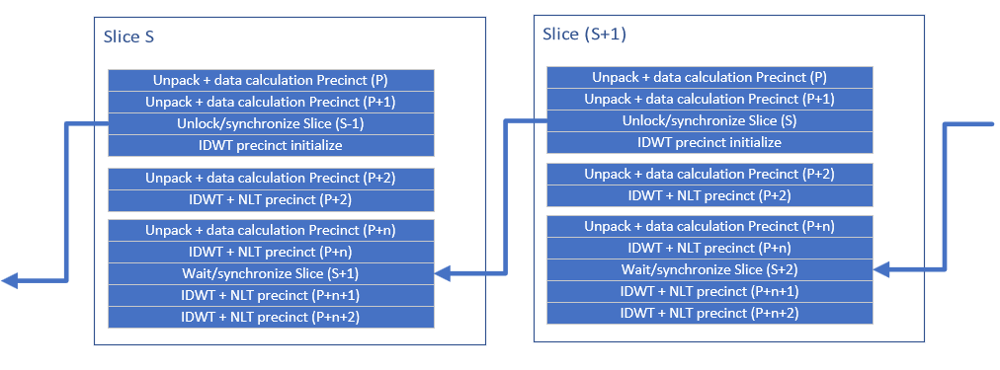

# Decoder Design for SVT-JPEGXS (Scalable Video Technology for JPEGXS Decoder)

[Top level](../../README.md)

## Table of Contents

## List of Figures

- [Figure 1](#figure-1-5-level-horizontal-and-2-level-vertical-picture-decomposition-into-bands-for-luma-component):
  5-level horizontal and 2-level vertical Picture decomposition into bands for Luma component
- [Figure 2](#figure-2-1-slice-4-precincts-and-multiple-packets-diagram): 1 Slice, 4 Precincts and multiple Packets diagram
- [Figure 3](#figure-3-high-level-decoder-process-dataflow): High-level decoder process dataflow
- [Figure 4](#figure-4-modules-of-the-svt-jpegxs-decoder-and-slices-synchronization): Modules of the SVT-JPEGXS decoder and
  slices synchronization

## Introduction

This document describes the Intel SVT-JPEGXS decoder design. In particular, the
decoder block diagram and multi-threading aspects are described. Besides, the
document contains brief descriptions of the SVT-JPEGXS decoder modules. This document is meant to be an accompanying
document to the &quot;C Model&quot; source code, which contains the more specific details of the inner working of the decoder.

# Definitions

This section contains definitions used throughout this design document.

## General Definitions

| **Term**           | **Definition**                                                                                                                                                                                                                           |
| ------------------ | ---------------------------------------------------------------------------------------------------------------------------------------------------------------------------------------------------------------------------------------- |
| Picture            | Collection of luma and chroma samples assembled into rectangular regions with a width, height and sample bit-depth.                                                                                                                      |
| Slice              | integral number of precincts whose wavelet coefficients can be entropy-decoded independently                                                                                                                                             |
| Precinct           | collection of quantization indices of all bands contributing to a given spatial region of the image                                                                                                                                      |
| Band               | input data to a specific wavelet filter type that contributes to the generation of one of the components of the image                                                                                                                    |
| GTLI               | (values 0-15) (Greatest Trimmed Line Index) Single value calculated per band, Restored in decoder from Quantization, Refinement and WeightTables. Specify number of least significant bits that will be removed during quantization      |
| GCLI               | (values 0-31) (Greatest common line index) Max used bits in group of 4 coefficients, when value <= GTLI all coefficients will be 0                                                                                                       |
| Significance Value | Max used bits in group of 8 GCLI's or 32 coefficients, when value <= GTLI all values can be ignored.                                                                                                                                     |
| SignificationBit   | (Significance Value < GTLI) if 0 ignore group for specific GTLI when GTLI >= GCLI.                                                                                                                                                       |
| Quantization value | Quantization bits (remove least significant bits from value with some rounding deadzone/uniform) (Value >> GTLI) when (GTLI >= GCLI) then 0 Pack data bits – Bits to pack value in bitstream GCLI-GTLI. If less than 0 then pack 0 bits. |

## Source Partitioning

The source picture is partitioned into various slices. Each slice is further divided into precincts.

Figure 1 shows the decomposition of the picture for one component into bands after Discrete Wavelet Transform (DWT) decomposition.



### Figure 1: 5-level horizontal and 2-level vertical Picture decomposition into bands for Luma component

Figure 2 shows the relationship between slice, precincts and packets.
A slice is divided into precincts. The grouping of lines of bands into packets is shown in the fourth precinct. Each packet
contributes to one line and one or multiple bands of a precinct.
Furthermore each packet consists of multiple subpackets where each subpacket contributes to one aspect of the data, such as
significance, GCLI, quantized coefficients and signs.



### Figure 2: 1 Slice, 4 Precincts and multiple Packets diagram

## High-level decoder architecture

The high-level decoder pipeline is shown in Figure 3. Further details on
individual stages are given in subsequent sections. The multi-threading aspect
of the decoder is also explained in detail in a separate section.

The architecture is simplistic and flexible enough to support an implementation in which
one slice at a time is decoded through the entire pipeline with a small delay due to synchronization between slices.
Precincts from slice (s+1) are used to inverse transform precincts (p+n+1) and (p+n+2) from slice (s) if vertical
decomposition is > 0.

In the SVT-JPEGXS decoder, a picture is divided into slices.
Parallelism in the decoder is achieved at the slice level.
Multiple slices from the same picture could be processed simultaneously, where each process could, for example, be
performing a different task in the decoding pipeline.

A high-level diagram of the decoder pipeline is shown in Figure 3.



### Figure 3. High-level decoder process dataflow

## Initialization Stage

The initialization stage is a single threaded process. It is where picture header parsing is done along with picture
buffers allocation.

### Universal Stage

Universal stage kernel is where the main decode modules are executed.
This stage is slice based. It reads the slice header, loops over precincts to unpack precinct, inverse quantize it and
inverse transform it. Precinct decoding is described in details in the decoder algorithms section.

### Final Stage

The final process is where all the synchronization is done: Releasing objects and reordering queues. Slices are properly
aligned with corresponding picture to properly reconstruct the picture from slices.

The reversible colour transform (RCT, Cpih=1) is applied per precinct, in the same stage as the IDWT. After the IDWT of
a precinct, each finished line of components 0-2 is copied to a scratch buffer, the inverse RCT is applied there and the
line is written to the output picture. The copy is needed because the IDWT line buffers are still read by the vertical
IDWT of the next precinct. This needs components 0-2 to be wavelet transformed and to have the same size, decomposition
levels and precinct height. RCT streams from the SVT-JPEGXS encoder always meet these conditions.

The other colour transforms (Star-Tetrix, Cpih=3), and RCT on components that do not meet the conditions above, are applied
to the whole frame. In that case "unpack precinct" and "precinct calculate data" are still performed in the universal
stage, but the IDWT, the colour transform and the output scaling (NLT) are performed in the final stage, after all slices
of the frame are decoded. This path does not scale with the number of threads and does not support
`output_bit_depth_msb_aligned`.

If vertical decomposition is > 0, the first 2 precinct lines of each slice need the last precincts of the previous slice
for the IDWT. When there is more than one universal thread and a slice has more than 2 precinct lines, the thread that
decodes slice (s) waits until slice (s+1) has unpacked its first 2 precinct lines (or its only line, if it is the last
slice and has just one) and calculates them itself. Otherwise, for example when the slice height is 2 precinct lines or
less, these lines are calculated in the final stage.

## Thread wake-up (timed wait)

The decoder stages hand work to each other through queues and condition variables, and a typical frame needs well over a
hundred thread wake-ups. When a waiting thread blocks with no timer pending, the CPU core it ran on may enter a deep idle
state (for example C6 on Intel Xeon). Waking up from a deep idle state takes about 200 us. The decoder pays that latency on
almost every hand-off, which lowers throughput and makes it vary a lot between runs.

On Linux the decoder therefore uses a *timed wait*. Before blocking, a waiting thread waits in short timed slices
(`sem_timedwait()` / `pthread_cond_timedwait()`), up to a total time budget. While a timer is pending, the kernel idle
governor keeps the core in a shallow idle state, so the thread wakes up quickly when work arrives. If no work arrives within
the budget, the thread falls back to a normal blocking wait and the core can go into a deep idle state. If a timed slice
fails with an unexpected error, the thread also falls back to the normal blocking wait. When a queue already has work, the
thread takes it without reading any clock.

Clocks:

- The time budget is always measured on `CLOCK_MONOTONIC`.
- Condition variables are created with `pthread_condattr_setclock(CLOCK_MONOTONIC)`, so their slices are on
  `CLOCK_MONOTONIC` as well.
- `sem_timedwait()` only accepts a `CLOCK_REALTIME` timeout. If the wall clock is changed while a thread waits on a queue
  (for example by NTP or `date`), only the slice that is running at that moment is affected. A forward jump ends it early.
  A backward jump can make it last as long as the jump, even longer than the budget. During that slice the thread
  behaves like the normal blocking wait: it still wakes up as soon as work arrives, but without the shallow idle state.
  The decoded output is never affected.

Scope:

- Only the decoder uses the timed wait. Each decoder session marks its own queues and condition variables in
  `svt_jpeg_xs_decoder_init()`. Encoder sessions, including encoder sessions in the same process as a decoder session (for
  example an ffmpeg transcode or a GStreamer pipeline), are not affected.
- The timed wait applies to every wait on the decoder's objects, including the blocking `svt_jpeg_xs_decoder_send_frame()`
  and `svt_jpeg_xs_decoder_get_frame()` calls made by the application. The frame pool API
  (`svt_jpeg_xs_frame_pool_get()`) is not affected.
- The library lowers the timer slack (`PR_SET_TIMERSLACK`) only on the threads it creates itself. Application threads keep
  their own timer slack.
- It is available on Linux only. It uses POSIX calls only, so it works with any Linux C library (for example glibc, musl
  or Android Bionic). On other platforms the decoder uses the normal blocking wait.

It is enabled by default. The following environment variables change it. They are read once per process, the first time
a decoder thread waits, so they must be set before the first decoder session starts.

| Variable              | Default | Description                                                                                          |
|-----------------------|---------|------------------------------------------------------------------------------------------------------|
| `SVT_JXS_TW_US`       | `1000`  | Time budget in microseconds. `0`, a negative value or an invalid value disables the timed wait.      |
| `SVT_JXS_TW_SLICE_US` | `50`    | Length of one timed slice in microseconds. `0`, a negative value or an invalid value keeps `50`.     |
| `SVT_JXS_TW_SLACK_NS` | `1000`  | Timer slack in nanoseconds for the library threads. `0` means `1`. Negative or invalid keeps `1000`. |

A value is valid only if the whole string is a decimal integer, for example `2000`. Values such as `2000us`, `2e3`,
`+2000`, `2000` with a leading space or an empty string are invalid. Values above one second (`1000000` us, or
`1000000000` ns for the slack) are clamped to one second.

How to choose the values:

- Keep the defaults unless measurements show a reason to change them. They were tuned on a Xeon at 1080p and 4K.
- A longer budget keeps cores in a shallow idle state for longer after the work runs out. That costs a little power when
  the decoder is idle between frames. A shorter budget saves that power but loses the benefit when frames arrive with gaps
  longer than the budget.
- A shorter slice wakes threads more often and costs more CPU time. A longer slice makes some hand-offs slower.
- The timer slack lets the kernel delay a timer expiry to merge it with other timers. With the Linux default (50 us) a
  50 us slice could be stretched to about 100 us.
- To compare against the plain blocking wait, run with `SVT_JXS_TW_US=0`.

Examples:

```shell
# Disable the timed wait
SVT_JXS_TW_US=0 ./SvtJpegxsDecApp -i <input_bitstream.bin> -o <output_file.yuv> --lp 5

# 2 ms budget with 20 us slices
SVT_JXS_TW_US=2000 SVT_JXS_TW_SLICE_US=20 ./SvtJpegxsDecApp -i <input_bitstream.bin> -o <output_file.yuv> --lp 5

# The same variables apply to the ffmpeg and GStreamer plugins
SVT_JXS_TW_US=0 ffmpeg -c:v libsvtjpegxs -i <input.mov> -f null -
```

On CPUs with a slow exit from deep C-states this raises decoder throughput and reduces run-to-run variation.
CPU usage increases because threads stay awake for a short time after each frame.

Hosts that already keep the cores out of deep idle states get no throughput gain, only the extra CPU usage. This is the
case, for example, when `/dev/cpu_dma_latency` is held below the exit latency of the deep idle state, as low-latency
tuning often does (tuned profiles, Media Transport Library / SMPTE ST 2110 setups). The extra CPU usage is largest with
few decoder threads. On such hosts set `SVT_JXS_TW_US=0` if CPU time is scarce.

## Decoder Algorithms

The following section describes the algorithms used in the
SVT-JPEGXS decoder per slice. The algorithms are done sequentially for each precinct in the slice.

An illustration of slice-based modules of the SVT-JPEGXS decoder and slices synchronization is shown in Figure 4.


### Figure 4. Modules of the SVT-JPEGXS decoder and slices synchronization

### Unpack Precinct

This module is where the GCLI and sign bits are being unpacked from bitstream through reading coefficients and prediction modes ( raw, vertical, significance or zero).
The process is done at the sub-packet level for every band.

### Data Calculation for Precinct

After the unpack stage, coefficients are being inverse quantized in the data calculation stage.
Inverse quantization type can be either uniform or deadzone.

After dequantization inv_image_shift is performed, this stage prepares dequantized coefficients for inverse transform by 2 steps:

1. Left-shift each coefficient by number of bits specified in bitstream header(IDWT use fixed-point arithmetic, left-shift increase precision)
2. Change coefficient coding from signbit(most significant bit) + abs(dwt) to U2.

### IDWT [Inverse transform Precinct]

Inverse transform is performed for every component per precinct.
As there is a dependency between slices, a recalculation of two previous precinct is needed.

### MCT [Multiple component transformations]

Optional stage that transforms the output array of the inverse wavelet transformation to intermediate picture samples values of the picture (RGB or Star-Tetrix)

The inverse RCT is applied line by line right after the IDWT of each precinct. Star-Tetrix is applied to the whole frame
in the final stage, see [Final Stage](#final-stage).

### NLT [Linear/Non-linear output scaling]

This stage uses intermediate picture sample values from MCT or IDWT (if MCT is not present) and reconstructs final picture.
Reconstruction is done by reducing bit precision (fixed point) and applying scaling method (Linear, Quadratic or Extended)

## Notes

The information in this document was compiled at **v0.10** of the code and may not
reflect the latest status of the design. For the most up-to-date
settings and implementation, it's recommended to visit the specific section of the code.
