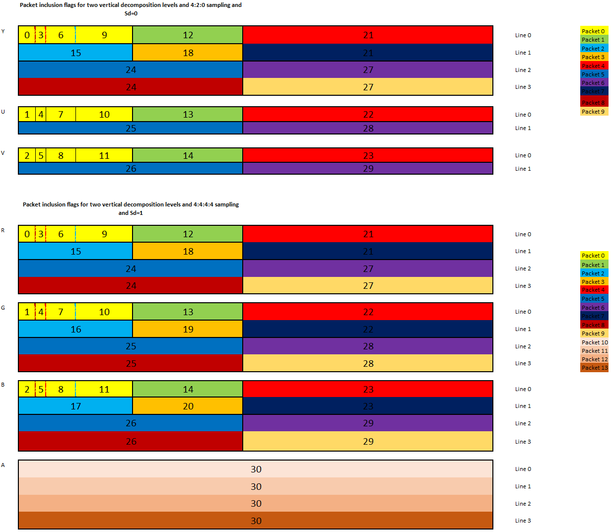
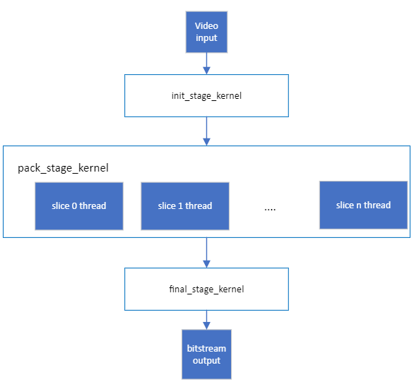
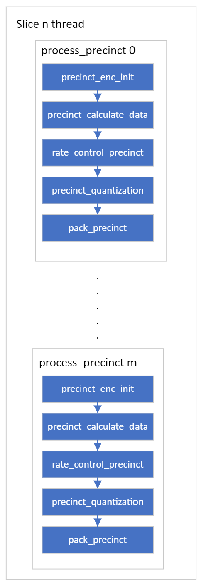

[Top level](../../README.md)

# Encoder Design for SVT-JPEGXS (Scalable Video Technology for JPEGXS Encoder)

## List of Figures
- [Figure 1](#figure-1): 5-level horizontal and 2-level vertical Picture decomposition into bands for Luma component
- [Figure 2](#figure-2): 1 Slice, 4 Precincts and multiple Packets diagram
- [Figure 3](#figure-3): Packets progression within precinct
- [Figure 4](#figure-4): High-level encoder process dataflow
- [Figure 5](#figure-5): Encoding pipeline per slice 

## List of Tables

# Introduction

This document describes the Intel SVT-JPEGXS encoder design. In particular, the encoder block diagram is described. This document is meant to be an accompanying document to the “C Model” source code, which contains the more specific details of the inner workings of each
algorithm.

# Definitions

This section contains definitions used throughout this design document.

### General Definitions

| **Term**                 | **Definition**                                                                                                        |
| ---                      | ---                                                                                                                   |
| Picture                  | Collection of luma and chroma samples assembled into rectangular regions with a width, height and sample bit-depth.   |
| Slice		           | integral number of precincts whose wavelet coefficients can be entropy-decoded independently |
| Precinct                 | collection of quantization indices of all bands contributing to a given spatial region of the image |
| Band		            | input data to a specific wavelet filter type that contributes to the generation of one of the components of the image |
| GTLI              	 | (values 0-15) (Greatest Trimmed Line Index) Single value calculated per band, Restored in decoder from Quantization, Refinement and WeightTables. Specify number of least significant bits that will be removed during quantization|
| GCLI                 | (values 0-31) (Greatest common line index) Max used bits in group of 4 coefficients, when value <= GTLI all coefficients will be 0                                    |
| Significance Value                    | Max used bits in group of 8 GCLI's or 32 coefficients , when value <= GTLI all values can be ignored.                                                    |
| SignificationBit 	| (Significance Value < GTLI) if 0 ignore group for specific GTLI when GTLI >= GCLI.                                                     |
| Quantization value                      | Quantization bits (remove least signifianct bits from value with some rounding deadzone/uniform) (Value >> GTLI) when (GTLI >= GCLI) then 0 Pack data bits – Bits to pack value in bitstream GCLI-GTLI. If less than 0 then pack 0 bits.   |

### Source Partitioning

The source picture is partitioned into various slices. Each slice is further divided into precincts.

Figure 1 shows the decomposition of the picture for one component into bands after Discrete Wavelet Transform (DWT) decomposition.

#### Figure 1: 5-level horizontal and 2-level vertical Picture decomposition into bands for Luma component

Figure 2 shows the relationship between slice, precincts and packets.
A slice is divided into precincts. The grouping of lines of bands into packets is shown in the fourth precinct. Each packet contributes to one line and one or multiple bands of a precinct.
Furthermore each packet consists of multiple subpackets where each subpacket contributes to one aspect of the data, such as significance, GCLI, quantized coefficients and signs.

#### Figure 2: 1 Slice, 4 Precincts and multiple Packets diagram

Figure 3 shows how single precinct is divided into multiple packets, (Sd=1 Number of components for which the wavelet decomposition is suppressed)

#### Figure 3: Packets progression within precinct

## High-level encoder architecture

The encoder is designed around *processes*. A process is an execution
thread in software or an IP core in hardware. 

The architecture is simplistic and flexible enough to support an implementation in which
one slice at a time is encoded through the entire pipeline.

In the SVT-JPEGXS encoder, a picture is divided into slices.
Parallelism in the encoder is achieved at the slice level. 
Multiple slices from the same picture could be processed simultaneously, where each process could, for example, be performing a different task in the encoding pipeline.

A high-level diagram of the encoder pipeline is shown in Figure 4.

#### Figure 4. High-level encoder process dataflow 

### Initialization Stage

 
 The initialization stage process is the first stage that takes pictures from input and split it into multiple slices.
 It is a single threaded and picture-based process that handles one
picture at a time in display order.

The initialization Process assembles the input information and creates the appropriate buffers that would travel with the input picture all along the encoding pipeline and passes this data along with the current encoder settings to the pack stage process.

### Pack Stage
Pack stage consists of looping over all precincts within one slice and processing them. More than one slice can be processed simultaneously. Precinct processing is described in details in the encoder algorithms section.

### Final Stage
The final process is where all the synchronization is done: Releasing objects and reordering queues. Slices are properly aligned with corresponding picture to properly reconstruct the picture from slices.

An illustration of the slice level
data processing is shown in Figure 5.

#### Figure 5. Encoding pipeline per slice 

## Encoder Algorithms

The following section describes the algorithms used in the
SVT-JPEGXS encoder per slice. The algorithms are done sequentially for each precinct in the slice.

### Precinct initialization

Coefficients buffer initialization based on bands sizes for all components (luma and chroma) of the precinct.

### Precinct Data Calculation

Picture data calculation performs two main stages: Discrete wavelet transform stage and group coding stage.

Discrete wavelet transform is applied to pixel values to decompose the picture into low frequency and high frequency coefficients. The wavelet filtering is done vertically and horizontally. Vertical decomposition range is [0..2] inclusive and horizontal decomposition range is [1..5] inclusive.

Since wavelet transformation runs across slice boundaries and slices are encoded independently, some precalculations are done to the first precinct in each slice to be used in the next precinct decomposition.
This precalculation is only performed if vertical decomposition is not 0.

group coding stage has three steps:
1)	Transform the dwt coefficients (some positive and some negative) into signbit(most significant bit) + abs(dwt)
2)	Generate the gc code per group. If gc_group_size = 4, gc_code = the most significant non-zero bit position of (abs(dwt1) | abs(dwt2) | abs(dwt3) | abs(dwt4))
3)	Signal the non-zero coefficients for the gc code generated in the step2.

### Precinct Rate Control

Precinct rate control consists of finding the best coding method with the lowest quality loss in quantization.

Truncation position (GTLI) is used for budget calculation. 
Initially a search for best quantization is done through setting refinement to 0 and calculating different truncation positions and corresponding budgets.
Then best refinement is searched based on the best quantization value selected.

GTLI is calculated from precinct quantization, precinct refinement and band priority defined by the weight table.

### Precinct Quantization

To further reduce the bitstream size, quantization is applied. It uses GTLI to quantize precincts coefficients.
Quantization type in JPEG XS can be deadzone or uniform.

### Precinct Pack

Packing process consists of writing encoding information to bitstream. Information consists of coding mode, GTLI, GCLI, quantization, refinement, transformation coefficients for each band, and any necessary information that the decoder needs to reconstruct the video following the JPEG XS specification.

## Notes

The information in this document was compiled at <mark>v0.9</mark> may not
reflect the latest status of the design. For the most up-to-date
settings and implementation, it's recommended to visit the section of the code.
